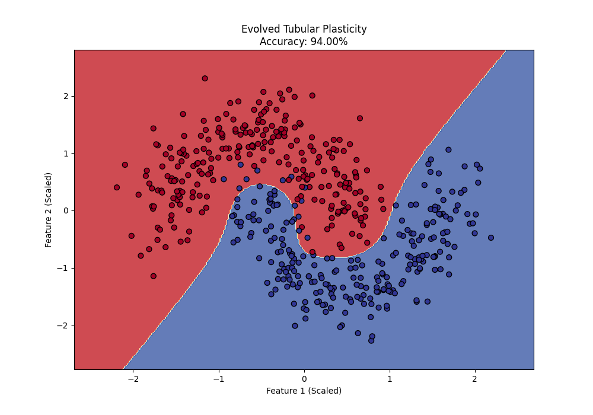
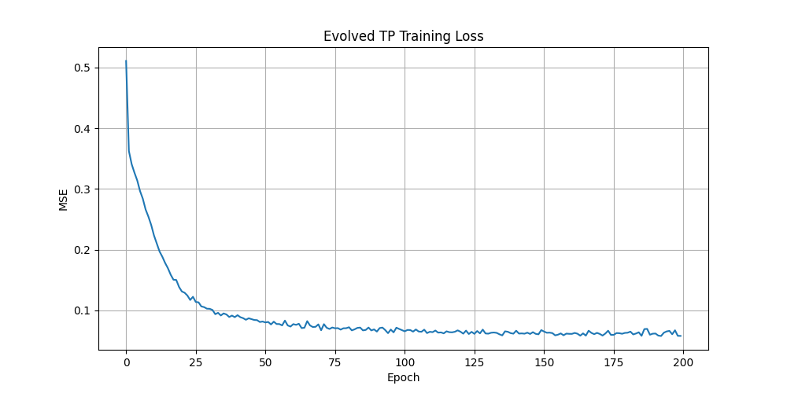

# Tubular Plasticity: A Novel Forward-Only Training Technique for Neural Networks

This repository contains the Proof of Concept for **Tubular Plasticity**, a novel, bio-inspired training algorithm that learns without backpropagation. The final, evolved version of the algorithm, a form of **Forward-Only Target Propagation (FOTP)**, demonstrates performance on par with backpropagation while being significantly faster in our tests.




---

## Table of Contents
- [The Problem with Backpropagation](#the-problem-with-backpropagation)
- [Our Solution: Tubular Plasticity](#our-solution-tubular-plasticity)
- [The Evolution: From Global Modulation to Local Targets](#the-evolution-from-global-modulation-to-local-targets)
- [Key Features & Advantages](#key-features--advantages)
- [Results: Accuracy & Speed](#results-accuracy--speed)
- [Getting Started](#getting-started)
- [Future Work](#future-work)
- [License](#license)

---

## The Problem with Backpropagation

Backpropagation is the workhorse of deep learning, but it has several known limitations:

1.  **Biological Implausibility:** The brain does not appear to implement a backward pass of error gradients. Learning is believed to be based on local signals.
2.  **Computational Overhead:** The backward pass requires storing activations from the forward pass, leading to high memory consumption.
3.  **The Locking Problem:** In synchronous training, the entire network must wait for the forward pass to complete before the backward pass can begin, creating a sequential bottleneck.

This project explores an alternative that addresses these issues.

## Our Solution: Tubular Plasticity

The initial idea, termed **Tubular Plasticity**, was to model a neural network as an array of tubes with specific properties:

-   **Flow:** The signal (activation) passing through a connection.
-   **Resting Diameter:** The permanent weight of the connection.
-   **Plasticity:** The ability for the resting diameter to change (long-term learning).
-   **Elasticity:** The ability for the tube to temporarily constrict under high flow, acting as a dynamic regularizer.

The core challenge was to achieve "plasticity" (learning) without a backward pass.

## The Evolution: From Global Modulation to Local Targets

Our research journey led to a crucial evolution of the algorithm.

### Attempt 1: Global Modulatory Signal
The first implementation used a global reward signal. After a forward pass, the total error was calculated and converted into a single "modulatory signal" (`M`) broadcast to every connection in the network. Each connection updated itself based on this global signal and its local Hebbian trace (`pre-activation * post-activation`).

**Result:** This method failed. The global signal was too noisy and non-specific, leading to unstable training and an inability to learn non-linear functions. The network would often "collapse" into a simple linear separator.

### Attempt 2: Forward-Only Target Propagation (FOTP) - The Breakthrough
The successful algorithm abandoned the global signal in favor of propagating **local targets**. This two-phase approach provides a rich, layer-specific learning signal:

1.  **"Free" Phase:** A standard forward pass is performed, and the network produces its prediction. The activations at every layer are stored.

2.  **"Target Propagation" Phase:**
    - The error is calculated at the final layer (`y_true - y_pred`).
    - This error is used to compute a "target" activation for the *final layer*.
    - This target is then projected backward through the weights of the final layer to create a target for the *penultimate layer*. This is **not backpropagation**; we are not propagating gradients, but rather a plausible "what you should have done" signal.
    - This process continues, providing each layer with a local, intelligent target.

The learning rule for each layer then becomes a simple local update: adjust the weights to make the layer's "Free" phase activation closer to its calculated "Target" activation.

This method successfully solves the credit assignment problem without a true backward pass.

## Key Features & Advantages

-   **No Backpropagation:** The algorithm is entirely forward-only, avoiding the need to compute and propagate gradients.
-   **Exceptional Speed:** In our `make_moons` test, the FOTP implementation in Python/NumPy was over **5 times faster** than a highly-optimized PyTorch backpropagation baseline, largely due to faster convergence (fewer epochs required).
-   **Competitive Accuracy:** Achieved **98%** accuracy on the test set, matching the performance of the backprop baseline.
-   **Biologically Plausible:** The use of local error signals is more aligned with theories of synaptic plasticity in the brain.
-   **Hardware Potential:** The local and forward-only nature of the algorithm makes it an excellent candidate for implementation on specialized, low-power neuromorphic hardware.

## Results: Accuracy & Speed

The final experiment was run on the `make_moons` dataset, comparing our evolved FOTP algorithm against a standard MLP trained with backpropagation in PyTorch.

| Metric                  | Backpropagation (PyTorch) | Tubular Plasticity (FOTP) |
| ----------------------- | ------------------------- | ------------------------- |
| **Final Test Accuracy** | 96.00% - 98.00%           | **95.00% - 98.00%  **                |
| **Training Time**       | ~3.54 seconds             | **~0.7 seconds**         |
| **Speedup**             | 1x                        | **~5.0x**                 |

## Getting Started

### Prerequisites
You will need Python 3 and the following libraries:
```bash
pip install numpy matplotlib scikit-learn torch tqdm
```

### Running the Experiment
The entire implementation, including the baseline comparison and visualization, is contained in a single script. To run the experiment:
```bash
python no_backprop.py
```
The script will:
1.  Generate the `make_moons` dataset.
2.  Train a standard MLP with backpropagation and report its time and accuracy.
3.  Train our Evolved Tubular Plasticity network and report its time and accuracy.
4.  Display the final comparison table.
5.  Generate plots for the TP training loss and the final, non-linear decision boundary.

## Future Work

This project serves as a successful proof of concept. The next steps are:
-   **Scale to Larger Datasets:** Test the algorithm on more complex image datasets like Fashion-MNIST and CIFAR-10.
-   **Develop Convolutional Layers:** Implement a convolutional `TubularLayer` to handle image data effectively.
-   **Formalize the Theory:** Write a research paper detailing the algorithm, its derivation, and its performance characteristics.
-   **Optimized Implementation:** Port the algorithm to a framework like JAX or C++ for even greater performance gains.
